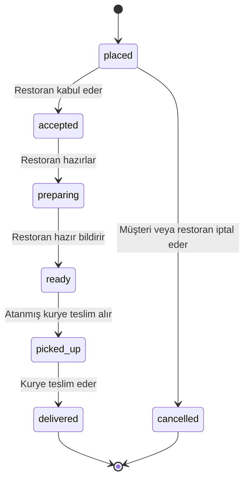
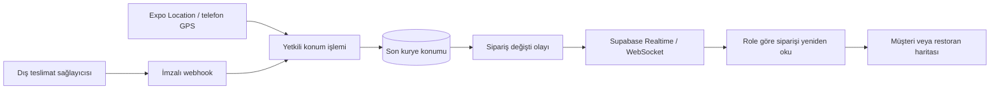

# Mimari ve erişim kuralları

## Üç uygulama yüzü, tek veri kaynağı

`apps/web` tarayıcı uygulaması ve sunucu webhook'unu; `apps/mobile` Android/iOS uygulamasını içerir. Her ikisi Supabase Auth ile oturum açar. Yetki, istemcide seçilen düğmeden değil, veritabanındaki onaylı profil ve sipariş sahipliğinden gelir.

Bir Supabase Auth kullanıcısına en fazla üç profil bağlanabilir. `unique (user_id, role)` kısıtı aynı türde ikinci profil oluşmasını engeller. E-posta ve şifre Auth'ta tutulur; profil tablosunda ikinci şifre tutulmaz. İstemciden değiştirilebilen kullanıcı metadata'sı yetki kaynağı değildir.

| Veri / işlem      | Müşteri                       | Restoran                                | Kurye                                            |
| ----------------- | ----------------------------- | --------------------------------------- | ------------------------------------------------ |
| Menüleri görme    | Evet                          | Evet                                    | Evet                                             |
| Menü değiştirme   | Hayır                         | Yalnız kendi menüsü                     | Hayır                                            |
| Sipariş oluşturma | Evet                          | Hayır                                   | Hayır                                            |
| Sipariş listesi   | Kendi siparişi                | Kendi restoranı                         | Hazır ve boş işler, kendine atanmış işler        |
| Müşteri adresi    | Kendi adresi                  | Hiçbir zaman                            | Yalnız atanmış sipariş `picked_up` durumundayken |
| Kurye konumu      | Kendi aktif siparişi          | Kendi siparişinde, teslim alınana kadar | Kendine atanmış aktif sipariş                    |
| Konum gönderme    | Hayır                         | Hayır                                   | Kendine atanmış aktif sipariş                    |
| Puanlama          | Kendi teslim edilmiş siparişi | Hayır                                   | Hayır                                            |

Bir kişi farklı profillere sahipse, o profillerin kendisine ait verilerine ayrı rollerden erişebilir. Restoran rolünü seçmek ona başka müşterilerin müşteri profillerini veya adreslerini açmaz.

## Sipariş akışı



Kurye ataması `ready` durumunda yapılır ve durumu değiştirmez. Atama atomiktir; iki kurye aynı işi alamaz. İlk sürümde bir kurye aynı anda yalnız bir aktif iş alabilir. Teslim alma işlemi onaylandıktan sonra müşteri koordinatı açılır ve mobil uygulama navigasyona yönlenir. Teslimat bittikten sonra kuryenin müşteri adresine erişimi kapanır.

Fiyat, ürün adı ve teslimat bedeli sunucudan alınarak siparişe kopyalanır. Sonradan menü değişse bile eski sipariş tutarı değişmez. Para tam sayı kuruşla saklanır. Tek bir sepette farklı restoranlar karışamaz. Aynı sipariş isteğinin tekrarı müşteri ve request ID ile tekilleştirilir; aynı ID ile farklı içerik gönderilirse reddedilir.

## Canlı konum



Mobil uygulama hedef olarak yaklaşık 5 saniye / 10 metre aralıklarla GPS güncellemesi ister. Gerçek sıklığı işletim sistemi, hareket, izinler ve pil koşulları etkiler. Sunucu en sık 3 saniyede bir yeni kayıt kabul eder; geriye giden zaman damgasını, 30 saniyeden eski veya fazla gelecekteki veriyi reddeder. 100 metreden kötü doğruluk konum olarak kabul edilmez. Harita 30 saniyeden eski konumu güncel göstermez.

Realtime tablosunda yalnız sipariş kimliği, revision ve zaman vardır. **Adres ve koordinat olay yüküne konmaz.** Abone her olaydan sonra role göre filtrelenmiş yanıtı alır. RLS, siparişe katılmayan kullanıcının olaylarını engeller. Bu tasarım farklı roller için hassas alanların aynı yayınla sızmasını önler. Restoran `picked_up` sonrasında kurye koordinatını da alamaz; güzergâhtan müşteri adresinin çıkarılması engellenir.

15 saniyelik ek yenileme, kaçırılan olayları toparlar ve henüz atanmamış kurye işlerini keşfeder. Konumun ana güncelleme yolu WebSocket'tir. Uygulama arka plana alındığında konum Expo TaskManager üzerinden sürer; rol değişiminde, çıkışta veya teslimat bitince durur. Sunucu terminal siparişe konum yazılmasını ayrıca reddeder. Force-stop, kapalı GPS veya internet yokluğunda sürekli takip garanti edilemez.

Kurye geçmişi tutulmaz; aktif sipariş için yalnız son konum kaydı vardır ve teslimat sonunda kaldırılır. Webhook tekilleştirme kaydı koordinat gövdesi yerine SHA-256 özeti saklar. Müşterinin teslimat adresi sipariş geçmişinde kalır; üretim öncesi saklama ve silme politikası belirlenecek.

## Sunucu sınırı

Hassas tablolar `private` şemasındadır. Uygulama rolleri bu tablolarda doğrudan SELECT/INSERT/UPDATE/DELETE yapamaz. Dışarı açık `public.app` bir `SECURITY INVOKER` sarmalayıcıdır. Gerekli ayrıcalıklar `private.app` içinde tutulur; sabit boş `search_path`, `auth.uid()` kontrolü, onaylı rol ve sipariş sahipliği denetimiyle sınırlıdır.

Private şema Data API'de açılmaz. `PUBLIC` için varsayılan function execute izinleri ilgili işlevlerden kaldırılır. Service key yalnız webhook sunucusunda kullanılır; web ve mobil uygulama publishable anahtarla çalışır.

## Puanlama

Yalnız sipariş sahibi, teslimat tamamlandıktan sonra puan verebilir. Restoran, servis ve kurye puanı ayrı alanlardır. Her sipariş kalemi için yemek puanı ayrı kayıttır. Bir yemek aynı siparişte iki adet alınmışsa o sipariş kalemi bir kez puanlanır. Başka siparişin yemeği puanlanamaz. Eksik yemek listesi, tekrar kayıt ve 1–5 aralığı dışındaki değerler işlemi tamamen geri alır.

## Webhook sözleşmesi

`POST /api/webhooks/delivery`, `Content-Type: application/json`, en fazla 16 KiB.

Gövde:

```json
{
  "order_id": "siparis-uuid",
  "courier_id": "atanmis-kurye-profili-uuid",
  "latitude": 41.01,
  "longitude": 29.02,
  "accuracy": 10,
  "recorded_at": "2026-09-17T12:00:00.000Z"
}
```

Örnek zaman ve UUID alanlarını gerçek olayla değiştir. `recorded_at` konumun örneklendiği zamandır.

Başlıklar:

- `x-delivery-event-id`: her olay için benzersiz UUID.
- `x-delivery-timestamp`: isteğin Unix zamanı, saniye.
- `x-delivery-signature`: `sha256=` öneki ve HMAC-SHA256 hex çıktısı.

İmzalanan veri: `timestamp + "." + eventId + "." + rawBody`. Anahtar `DELIVERY_WEBHOOK_SECRET`. Zaman penceresi 5 dakikadır; konumun yaşı ayrıca 30 saniyeyle sınırlıdır. Aynı event ID aynı gövdeyle tekrar gelirse tekrar uygulanmaz; farklı gövdeyle gelirse hata döner. İşlem hataları event ID'yi tüketmez. İmza karşılaştırması sabit zamanlı yapılır.

Webhook şu anda sağlayıcıdan bağımsız bir sözleşmedir; bir firmanın gerçek webhook'una henüz bağlanmış değildir. Mobil GPS için webhook gerekmez. Ödeme sağlayıcısı seçildiğinde onun kendi imza ve olay modeli ayrı bir uç noktada uygulanacak.

## Haritalar ve dağıtım

Web haritası Leaflet ve OpenStreetMap raster tile servisini kullanır; atıf gösterilir. Üretim trafiğinde servis sağlayıcısı ve kapasite planı gerekir. [OSM tile politikası](https://operations.osmfoundation.org/policies/tiles/) geçerlidir.

Mobilde `react-native-maps`: iOS Apple Maps, Android Google Maps. Android anahtarı paket adı ve imza sertifikasıyla kısıtlanmalıdır. Navigasyon [Google Maps URL](https://developers.google.com/maps/documentation/urls/get-started) ile açılır; bu linkin kendisi API anahtarı istemez.

EAS Update, `fingerprint` runtime politikası ve üç ayrı kanal kullanır. Native değişikliklerde build yenilenir. Veritabanı değişiklikleri ise mobil OTA'ya dahil değildir; eski uygulama sürümleriyle geriye uyum gözetilerek ayrıca yayımlanır.
